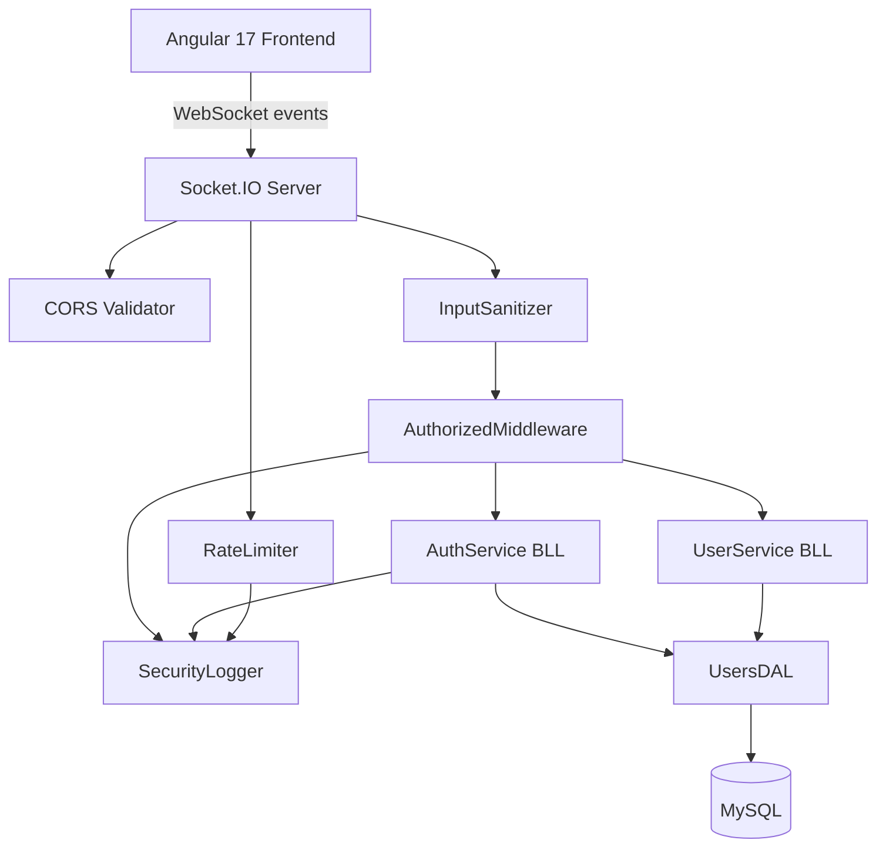

# Documento de Diseño: Security Hardening

## Visión General

Este documento describe el diseño técnico para el endurecimiento de seguridad de **App Base**. Todas las decisiones respetan la arquitectura existente: comunicación exclusiva por WebSockets (Socket.IO), patrón Controller → BLL → DAL, TypeScript en backend y Angular 17 en frontend.

El hardening se organiza en 8 áreas de mejora que corrigen vulnerabilidades identificadas sin introducir cambios disruptivos en la arquitectura.

---

## Arquitectura

### Diagrama de componentes afectados



### Principios de diseño

- **Sin HTTP REST**: Todos los cambios de backend se implementan sobre el canal WebSocket existente.
- **Capas respetadas**: La sanitización ocurre en Controller, la lógica en BLL, el acceso a datos en DAL.
- **Retrocompatibilidad**: Los eventos WebSocket existentes (`auth/login`, `auth/renewToken`, etc.) mantienen su nombre y estructura de respuesta.
- **Configuración por entorno**: Los nuevos parámetros se añaden a `.env` y `.env.template`.

---

## Componentes e Interfaces

### 1. Nuevas variables de entorno

Se añaden a `.env.template`:

```
# CORS - orígenes permitidos separados por coma
APP_CORS_ORIGINS="http://localhost:4200"

# Rate limiting WebSocket
APP_RATE_LIMIT_WINDOW_MS=60000
APP_RATE_LIMIT_MAX_EVENTS=200
APP_RATE_LIMIT_LOGIN_MAX=10
APP_RATE_LIMIT_LOGIN_WINDOW_MS=300000

# Inactividad de sesión en frontend (minutos)
APP_INACTIVITY_TIMEOUT_MINUTES=30
```

### 2. `utils/inputSanitizer.ts` (nuevo)

Utilidad reutilizable para sanitizar y validar inputs en los controladores.

```typescript
export class InputSanitizer {
  /** Escapa caracteres HTML peligrosos */
  static sanitizeString(value: string, maxLength?: number): string

  /** Valida que el valor es un número entero positivo */
  static validatePositiveInt(value: any, fieldName: string): number

  /** Valida campo requerido (no null, no undefined, no vacío) */
  static requireField(value: any, fieldName: string): void

  /** Sanitiza un objeto completo: aplica sanitizeString a todos los campos string */
  static sanitizeObject(obj: Record<string, any>, schema: SanitizeSchema): Record<string, any>
}

interface SanitizeSchema {
  [field: string]: { type: 'string' | 'number' | 'boolean'; maxLength?: number; required?: boolean }
}
```

### 3. `utils/securityLogger.ts` (nuevo)

Servicio de logging de eventos de seguridad. Extiende el `Logger` existente.

```typescript
export enum SecurityEventType {
  LOGIN_FAILED = 'LOGIN_FAILED',
  LOGIN_SUCCESS = 'LOGIN_SUCCESS',
  ACCOUNT_LOCKED = 'ACCOUNT_LOCKED',
  TOKEN_INVALID = 'TOKEN_INVALID',
  TOKEN_EXPIRED = 'TOKEN_EXPIRED',
  ACCESS_DENIED = 'ACCESS_DENIED',
  PASSWORD_CHANGED = 'PASSWORD_CHANGED',
  PASSWORD_RECOVERY_REQUESTED = 'PASSWORD_RECOVERY_REQUESTED',
  PASSWORD_RECOVERY_COMPLETED = 'PASSWORD_RECOVERY_COMPLETED',
  RATE_LIMIT_EXCEEDED = 'RATE_LIMIT_EXCEEDED',
}

export interface SecurityLogEntry {
  timestamp: string       // ISO 8601
  event: SecurityEventType
  username?: string
  ip?: string
  result: 'SUCCESS' | 'FAILURE'
  details?: string
}

export default class SecurityLogger {
  log(entry: SecurityLogEntry): void
}
```

Los logs se escriben en `data/logs/security.log` con rotación diaria.

### 4. `server/rateLimiter.ts` (nuevo)

Middleware de Socket.IO para limitar la tasa de eventos por socket.

```typescript
export class RateLimiter {
  /** Registra un evento para un socket. Retorna true si está dentro del límite. */
  checkLimit(socketId: string, eventName: string): boolean

  /** Middleware Socket.IO: aplica rate limiting global y específico para auth/login */
  middleware(socket: Socket, next: Function): void
}
```

Implementación con `Map<socketId, { count, windowStart }>` en memoria. No requiere Redis para esta fase.

### 5. Cambios en `server/server.ts`

- Reemplazar `origin: '*'` por lista desde `APP_CORS_ORIGINS`.
- Añadir validación de `APP_SEED` al arranque.
- Registrar el middleware `RateLimiter` en el namespace de Socket.IO.

```typescript
// Validación de APP_SEED al arranque
private validateConfiguration(): void {
  if (!process.env.APP_SEED) throw new Error('APP_SEED no está configurada');
  if (process.env.APP_NODE_ENV === 'production') {
    if (process.env.APP_SEED.length < 32) throw new Error('APP_SEED debe tener al menos 32 caracteres en producción');
    if (!/(?=.*[a-zA-Z])(?=.*[0-9])(?=.*[^a-zA-Z0-9])/.test(process.env.APP_SEED)) {
      throw new Error('APP_SEED debe contener letras, números y caracteres especiales en producción');
    }
  }
}
```

### 6. Cambios en `services/user/auth.bll.ts`

**Payload JWT mínimo:**
```typescript
// Antes
var token = jwt.sign({ user }, process.env.APP_SEED, { expiresIn: ... });

// Después
const payload = { id: user.id, username: user.username, role_id: user.role_id };
var token = jwt.sign({ user: payload }, process.env.APP_SEED, { expiresIn: ... });
```

**Invalidación de tokens de recuperación:**
- Nuevo campo `recovery_token_hash` en tabla `users` (VARCHAR 64, nullable).
- Nuevo campo `recovery_token_created_at` en tabla `users` (DATETIME, nullable).
- Al solicitar recuperación: generar token, guardar `SHA-256(token)` en BD, invalidar el anterior.
- Al validar token de recuperación: comparar `SHA-256(tokenRecibido)` con el almacenado.
- Al completar cambio de contraseña: limpiar `recovery_token_hash` y `recovery_token_created_at`.

**Logging de eventos de autenticación:**
- Añadir llamadas a `SecurityLogger` en los puntos de login fallido, bloqueo de cuenta, token inválido.

### 7. Cambios en `server/middlewares/authorized.middleware.ts`

- En `checkToken()`: añadir llamada a `SecurityLogger` cuando el token es inválido o expirado.
- En `isAllowed()` / `isAllowedMultiple()`: añadir llamada a `SecurityLogger` cuando se deniega el acceso.
- Consultar la BD para obtener datos actualizados del usuario en lugar de usar solo el payload del token.

### 8. Cambios en `models/user.model.ts`

```typescript
// Cambio de tipo del campo attempts
attempts: {
  type: DataTypes.INTEGER(11),  // antes: INTEGER(1)
  allowNull: false,
  defaultValue: 0
},
// Nuevos campos para recuperación de contraseña
recovery_token_hash: {
  type: DataTypes.STRING(64),
  allowNull: true,
  defaultValue: null
},
recovery_token_created_at: {
  type: DataTypes.DATE,
  allowNull: true,
  defaultValue: null
}
```

### 9. Cambios en controladores WebSocket (backend)

Todos los controladores en `controllers/ws/` deben aplicar `InputSanitizer` al inicio del método, antes de llamar al BLL:

```typescript
// Ejemplo en auth.controller.ts
public async login(req: any, socket: Socket) {
  InputSanitizer.requireField(req.userName, 'userName');
  InputSanitizer.requireField(req.password, 'password');
  const sanitized = InputSanitizer.sanitizeObject(req, {
    userName: { type: 'string', maxLength: 45, required: true },
    password: { type: 'string', maxLength: 100, required: true }
  });
  // ... resto del método
}
```

### 10. Cambios en el Frontend (Angular 17)

**Servicio de inactividad** (`services/share/inactivity.service.ts`, nuevo):
```typescript
@Injectable({ providedIn: 'root' })
export class InactivityService {
  private timeout: number;
  private warningTimeout: number;

  startWatching(): void   // Inicia los timers y escucha eventos DOM
  resetTimer(): void      // Reinicia el contador
  stopWatching(): void    // Limpia los timers
}
```

**Validación de contraseña** (`utils/password-validator.ts`, nuevo):
```typescript
export const PASSWORD_REGEX = /^(?=.*[0-9])(?=.*[A-ZÑ])(?=.*[a-zñ])(?=.*[$€#%&_-])\S{6,15}$/;

export function validatePassword(password: string): { valid: boolean; errors: string[] }
```

---

## Modelos de Datos

### Migración de base de datos

```sql
-- Cambio de tipo del campo attempts
ALTER TABLE users MODIFY COLUMN attempts INT(11) NOT NULL DEFAULT 0;

-- Nuevos campos para invalidación de tokens de recuperación
ALTER TABLE users 
  ADD COLUMN recovery_token_hash VARCHAR(64) NULL DEFAULT NULL,
  ADD COLUMN recovery_token_created_at DATETIME NULL DEFAULT NULL;
```

### Estructura actualizada de la tabla `users`

| Campo | Tipo | Cambio |
|-------|------|--------|
| `attempts` | `INT(11)` | Antes `INT(1)` |
| `recovery_token_hash` | `VARCHAR(64) NULL` | Nuevo |
| `recovery_token_created_at` | `DATETIME NULL` | Nuevo |

---

## Propiedades de Corrección

Una propiedad es una característica o comportamiento que debe mantenerse verdadero en todas las ejecuciones válidas del sistema. Las propiedades sirven como puente entre las especificaciones legibles por humanos y las garantías de corrección verificables automáticamente.


### Propiedad 1: Validación de CORS es exhaustiva y correcta

*Para cualquier* string de origen, la función de validación de CORS debe aceptarlo si y solo si está incluido en la lista `APP_CORS_ORIGINS`. No debe haber falsos positivos (aceptar orígenes no autorizados) ni falsos negativos (rechazar orígenes autorizados).

**Valida: Requisitos 1.1, 1.2**

---

### Propiedad 2: El contador de rate limiting refleja fielmente los eventos recibidos

*Para cualquier* socket y cualquier secuencia de N eventos dentro de la ventana de tiempo, el contador interno del `RateLimiter` debe ser exactamente N. El contador no debe incrementarse fuera de la ventana ni decrementarse sin que la ventana haya expirado.

**Valida: Requisitos 2.1, 2.2**

---

### Propiedad 3: El límite de login es siempre más restrictivo que el límite general

*Para cualquier* configuración válida del `RateLimiter`, el límite máximo de eventos para `auth/login` debe ser menor o igual que el límite general de eventos por socket. Esta relación debe mantenerse independientemente de los valores configurados.

**Valida: Requisito 2.3**

---

### Propiedad 4: El payload JWT contiene exactamente los campos mínimos requeridos

*Para cualquier* usuario válido, el payload del token JWT generado por `AuthService` debe contener exactamente los campos `id`, `username` y `role_id`, y no debe contener campos sensibles como `password`, `email`, `attempts` o `active`.

**Valida: Requisitos 3.1, 3.2**

---

### Propiedad 5: El servicio de inactividad reinicia el timer ante cualquier interacción

*Para cualquier* tipo de evento de usuario (clic, teclado, movimiento de ratón), el `InactivityService` debe reiniciar el contador de inactividad, de modo que el tiempo restante hasta el logout sea siempre igual al timeout configurado inmediatamente después de cualquier interacción.

**Valida: Requisitos 4.1, 4.5**

---

### Propiedad 6: El timeout de inactividad siempre dispara el logout

*Para cualquier* configuración de timeout, si el usuario no interactúa durante exactamente ese período, el `InactivityService` debe emitir el evento de logout. Esta propiedad debe mantenerse para cualquier valor de timeout (no solo el valor por defecto).

**Valida: Requisito 4.2**

---

### Propiedad 7: Los tokens de recuperación son únicos entre solicitudes consecutivas

*Para cualquier* usuario, dos solicitudes consecutivas de recuperación de contraseña deben generar tokens diferentes. El token de la primera solicitud debe quedar invalidado cuando se genera el segundo.

**Valida: Requisitos 5.1, 5.5**

---

### Propiedad 8: Verificación de token de recuperación es un round-trip de hash

*Para cualquier* token de recuperación generado, `SHA-256(token)` almacenado en BD debe coincidir con `SHA-256(token recibido)` al validar. Un token modificado en cualquier carácter debe fallar la verificación.

**Valida: Requisito 5.3**

---

### Propiedad 9: Un token de recuperación usado no puede usarse de nuevo

*Para cualquier* token de recuperación válido, después de completar el cambio de contraseña, el mismo token debe ser rechazado en cualquier intento posterior de validación. La operación de invalidación es idempotente: invalidar un token ya invalidado no produce error.

**Valida: Requisito 5.4**

---

### Propiedad 10: La validación de APP_SEED rechaza cualquier secreto débil en producción

*Para cualquier* string que no cumpla simultáneamente longitud >= 32 caracteres, presencia de letras, presencia de números y presencia de caracteres especiales, la función de validación de `APP_SEED` debe retornar un error en entorno `production`. Para cualquier string que cumpla todos los criterios, debe retornar éxito.

**Valida: Requisitos 6.1, 6.2, 6.3**

---

### Propiedad 11: La validación de contraseña frontend es equivalente a la del backend

*Para cualquier* string de contraseña, el resultado de `validatePassword()` en el frontend debe coincidir con el resultado de la validación regex del backend. No debe haber contraseñas que el frontend acepte y el backend rechace, ni viceversa.

**Valida: Requisitos 7.1, 7.2**

---

### Propiedad 12: Cada entrada del SecurityLogger contiene todos los campos requeridos

*Para cualquier* evento de seguridad registrado, la entrada en el log debe contener: `timestamp` en formato ISO 8601 válido, `event` de tipo `SecurityEventType`, `result` con valor `SUCCESS` o `FAILURE`, e `ip` cuando está disponible. Ningún campo obligatorio puede ser `undefined` o `null`.

**Valida: Requisitos 8.1, 8.8**

---

### Propiedad 13: El InputSanitizer escapa todos los caracteres HTML peligrosos

*Para cualquier* string de entrada que contenga caracteres HTML especiales (`<`, `>`, `"`, `'`, `&`), el resultado de `sanitizeString()` no debe contener ninguno de esos caracteres sin escapar. La función debe ser idempotente: aplicarla dos veces produce el mismo resultado que aplicarla una vez.

**Valida: Requisito 9.1**

---

### Propiedad 14: El InputSanitizer hace cumplir los límites de longitud y tipos

*Para cualquier* campo con `maxLength` definido, el string resultante de `sanitizeString()` debe tener longitud <= `maxLength`. *Para cualquier* valor no numérico pasado a `validatePositiveInt()`, debe lanzarse una `ControlException`. *Para cualquier* campo requerido con valor `null`, `undefined` o cadena vacía, `requireField()` debe lanzar `ControlException`.

**Valida: Requisitos 9.2, 9.3, 9.4**

---

### Propiedad 15: El campo attempts nunca toma valores negativos

*Para cualquier* secuencia de operaciones sobre el campo `attempts` de un usuario (incremento, reset a 0, actualización), el valor almacenado en base de datos debe ser siempre >= 0.

**Valida: Requisito 10.2**

---

## Manejo de Errores

### Errores de configuración al arranque

Los errores de configuración (`APP_SEED` débil, `APP_CORS_ORIGINS` ausente en producción) deben lanzarse como `Error` estándar de Node.js antes de que el servidor empiece a escuchar conexiones. El proceso debe terminar con código de salida no cero.

### Errores de rate limiting

```typescript
socket.emit("error_message", { message: "Demasiadas peticiones. Inténtalo más tarde.", code: 429 });
socket.disconnect(true);
```

### Errores de sanitización

```typescript
throw new ControlException('El campo [nombre] contiene caracteres no permitidos', 400);
throw new ControlException('El campo [nombre] es obligatorio', 400);
```

### Errores de token de recuperación

```typescript
throw new ControlException('El enlace de recuperación ya ha sido utilizado o ha expirado', 401);
throw new ControlException('El enlace de recuperación no es válido', 401);
```

---

## Estrategia de Testing

### Enfoque dual: tests unitarios + tests basados en propiedades

Los tests unitarios verifican ejemplos concretos y casos límite. Los tests basados en propiedades verifican invariantes universales con entradas generadas aleatoriamente. Ambos son complementarios y necesarios.

**Librería de property-based testing**: `fast-check` (TypeScript/Node.js)

```bash
npm install --save-dev fast-check
```

### Tests unitarios

Se enfocan en:
- Casos de configuración específicos (APP_SEED vacía, CORS con lista de un elemento)
- Flujos de autenticación completos (login exitoso, login fallido, bloqueo)
- Integración entre componentes (Controller → BLL → DAL)
- Casos límite de sanitización (string vacío, string con solo espacios, longitud exactamente en el límite)

### Tests basados en propiedades

Cada propiedad del diseño debe implementarse como un test `fast-check`. Configuración mínima: **100 iteraciones** por propiedad.

Formato de etiqueta para cada test:
```
Feature: security-hardening, Propiedad N: [texto de la propiedad]
```

**Ejemplo de test para Propiedad 13 (InputSanitizer idempotente):**
```typescript
// Feature: security-hardening, Propiedad 13: El InputSanitizer escapa todos los caracteres HTML peligrosos
it('sanitizeString es idempotente', () => {
  fc.assert(
    fc.property(fc.string(), (input) => {
      const once = InputSanitizer.sanitizeString(input);
      const twice = InputSanitizer.sanitizeString(once);
      return once === twice;
    }),
    { numRuns: 100 }
  );
});
```

**Ejemplo de test para Propiedad 4 (payload JWT mínimo):**
```typescript
// Feature: security-hardening, Propiedad 4: El payload JWT contiene exactamente los campos mínimos
it('el payload JWT no contiene campos sensibles', () => {
  fc.assert(
    fc.property(
      fc.record({ id: fc.integer(), username: fc.string(), role_id: fc.integer(),
                  password: fc.string(), email: fc.emailAddress(), attempts: fc.integer() }),
      (user) => {
        const token = authService.generateToken(user);
        const decoded = jwt.decode(token) as any;
        return decoded.user.id !== undefined
          && decoded.user.username !== undefined
          && decoded.user.role_id !== undefined
          && decoded.user.password === undefined
          && decoded.user.email === undefined
          && decoded.user.attempts === undefined;
      }
    ),
    { numRuns: 100 }
  );
});
```

### Configuración de tests

```json
// package.json (backend)
{
  "scripts": {
    "test": "jest --runInBand",
    "test:run": "jest --runInBand --forceExit"
  },
  "devDependencies": {
    "jest": "^29.x",
    "ts-jest": "^29.x",
    "fast-check": "^3.x",
    "@types/jest": "^29.x"
  }
}
```
